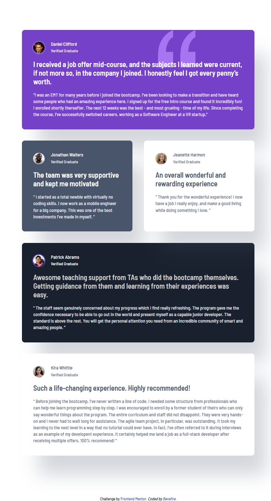
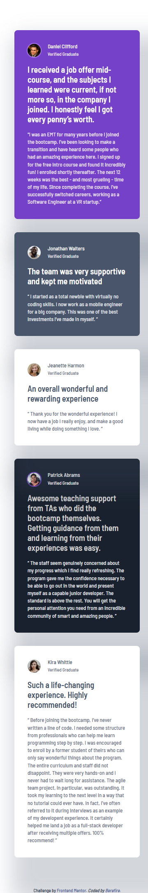

# Frontend Mentor - Testimonials grid section solution

This is a solution to the [Testimonials grid section challenge on Frontend Mentor](https://www.frontendmentor.io/challenges/testimonials-grid-section-Nnw6J7Un7). Frontend Mentor challenges help you improve your coding skills by building realistic projects.

---

## Table of contents

- [Overview](#-overview)
  - [The challenge](#-the-challenge)
  - [Screenshot](#-screenshot)
    - [Desktop](#desktop)
    - [Tablet](#tablet)
    - [Mobile](#mobile)
  - [Links](#-links)
- [My Process](#️-my-process)
  - [Architecture](#️-architecture)
  - [Component Strategy](#-component-strategy)
  - [Built With](#-built-with)
  - [Design System Foundations](#-design-system-foundations)
  - [Responsive Strategy](#-responsive-strategy)
  - [What I Reinforced](#-what-i-reinforced)
  - [Accessibility Considerations](#-accessibility-considerations)
  - [Future Improvements](#-future-improvements)
- [Author](#-author)
- [Acknowledgments](#-acknowledgments)

---

## 📋 Overview

This project recreates the Testimonials Grid layout using semantic HTML and a scalable CSS architecture based on **CUBE CSS** principles combined with **BEM methodology**.

The focus was not only visual accuracy but building a maintainable and portable component architecture.

---

## 🎯 The challenge

Users should be able to:

- View the optimal layout across mobile, tablet, and desktop breakpoints
- Experience a structured grid layout built with `grid-template-areas`
- Read semantically structured testimonials
- See a responsive layout that preserves visual hierarchy

---

## 📸 Screenshot

### Desktop


### Tablet



### Mobile



---

## 🔗 Links

- Solution URL: [https://www.frontendmentor.io/solutions/testimonials-grid-with-cube-css-and-bem-architecture-azcBx_z1iw](https://www.frontendmentor.io/solutions/testimonials-grid-with-cube-css-and-bem-architecture-azcBx_z1iw)
- Live Site URL: [https://berefire.github.io/testimonials-grid-section/](https://berefire.github.io/testimonials-grid-section/)

---

## ⚙️ My Process

This project was built using a **mobile-first workflow**, progressively enhancing the layout using CSS Grid at tablet and desktop breakpoints.

The primary goal was to separate layout logic from component styling.

---

### 🏗️ Architecture

The project follows the **CUBE CSS** methodology and is organized into structured layers:

```html
css/
├── base/
│   ├── fonts.css
│   ├── reset.css
│   ├── tokens.css
│   └── global.css
│
├── composition/
│   ├── cover.css
│   ├── page.css
│   ├── container.css
│   ├── testimonials-grid.css
│   ├── stack.css
│   └── box.css
│
├── utilities/
│   └── link.css
│
├── blocks/
│   ├── card.css
│   └── attribution.css
│
└── main.css
```

### Layer Responsibilities

- **Base** → Reset, tokens, typography foundation
- **Composition** → Layout primitives and structural patterns
- **Utilities** → Small reusable helpers
- **Blocks** → Self-contained components

This ensures:

- Layout does not leak into components
- Components remain portable
- The system is scalable

---

### 🧩 Component Strategy

The `card` component follows strict BEM conventions.

Example:

```html
<article class="[ card card--purple ] [ box-lg ]">
```

- `card` → Base block
- `.card__element` → Internal structure
- `.card--modifier` → Visual variants

Internal structure example:

```html
<div class="card__header">
  
  <div class="card__user">
    <p class="card__name"></p>
    <p class="card__role"></p>
  </div>
</div>

<h2 class="card__title"></h2>

<blockquote class="card__quote">
  Testimonial content
</blockquote>
```

Grid positioning is handled exclusively at the composition level, keeping the block independent.

---

### 🛠 Built With

- Semantic HTML5
- CSS Custom Properties (Design Tokens)
- CSS Grid (grid-template-areas)
- Mobile-first workflow
- CUBE CSS architecture
- BEM naming conventions
- Logical properties (margin-block, inline-size)
- Base font-size: 13px
- Local font hosting (Barlow Semi Condensed)

---

### 🎨 Design System Foundations

The project is powered by a centralized token system. Design Tokens include:

- Color system
- Spacing scale (base 13px)
- Typography scale
- Font weights
- Shadows
- Border radius
- Breakpoints (rem-based, 16px reference)

Example:

```css
:root {
  --space-lg: 2.4615rem;
  --fs-md: 1.538rem;
  --container-max-desktop: 69.625rem;
}
```

This allows:

- Consistent rhythm
- Easier refactoring
- Predictable scaling

---

### 📐 Responsive Strategy

The layout is controlled through a dedicated composition:

```html
.testimonials-grid
```

- **Mobile:** Single column grid using gap.
- **Tablet:** Two-column layout using grid-template-areas.
- **Desktop:** Four-column asymmetric layout.

The container controls the global width:

- Tablet → 647px
- Desktop → 1114px

Cards never control their own width; the layout does.

---

### 📚 What I Reinforced

Through this project, I reinforced:

- True separation of concerns in CUBE CSS
- Proper use of BEM without positional naming
- Avoiding layout logic inside components
- Using containers instead of max-width on items
- Semantic improvements with `<blockquote>`
- Architectural thinking instead of visual-only styling

---

### ♿ Accessibility Considerations

- Semantic landmarks (main, section, article)
- Testimonials wrapped in `<blockquote>`
- Decorative images marked with aria-hidden="true"
- Descriptive alt attributes
- Proper heading structure
- Sufficient color contrast
- Respect for prefers-reduced-motion
- Logical properties for better internationalization

---

### 🚀 Future Improvements

- Introduce container queries
- Implement CSS @layer
- Expand token system for theme variants
- Convert layout primitives into reusable patterns
- Add visual regression testing

---

## 👤 Author

- Frontend Mentor - [@berefire](https://www.frontendmentor.io/profile/berefire)
- GitHub - [@berefire](https://github.com/berefire)

---

## 🙏 Acknowledgments

Thanks to Frontend Mentor for providing realistic challenges that encourage architectural thinking, not just layout replication.
